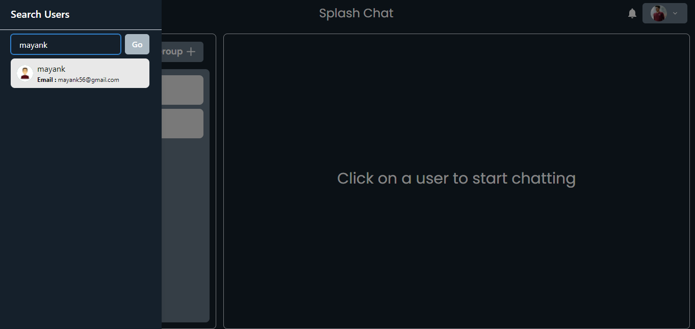
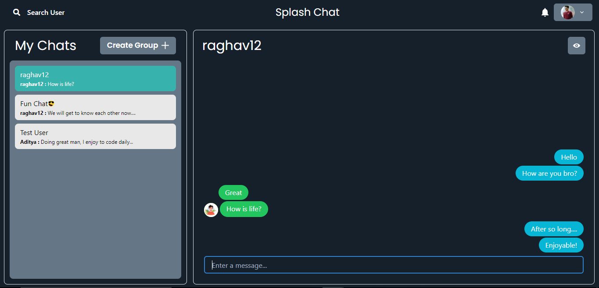
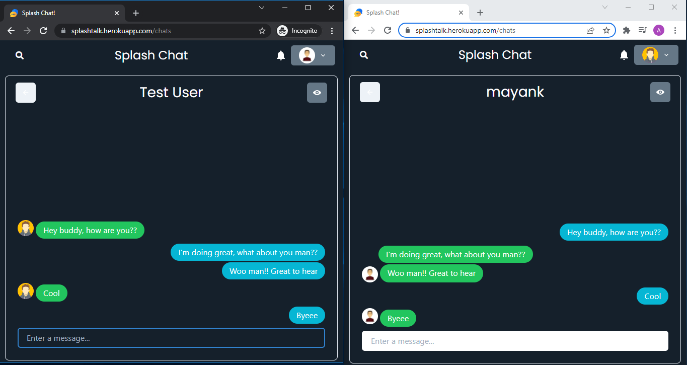
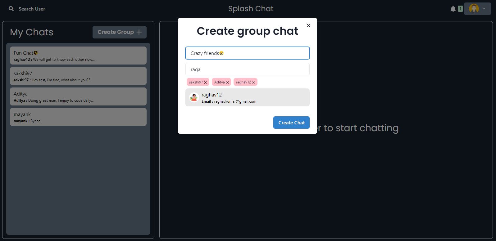
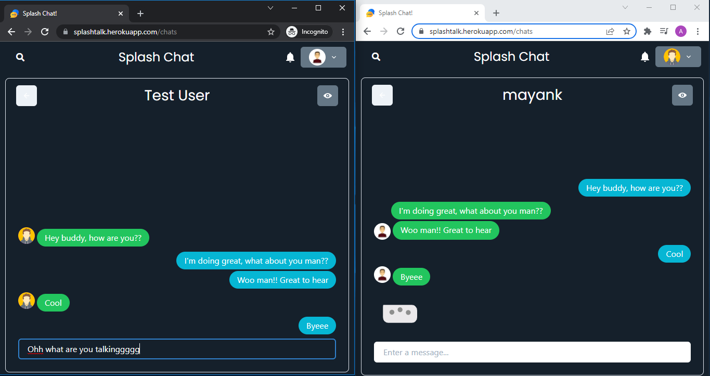
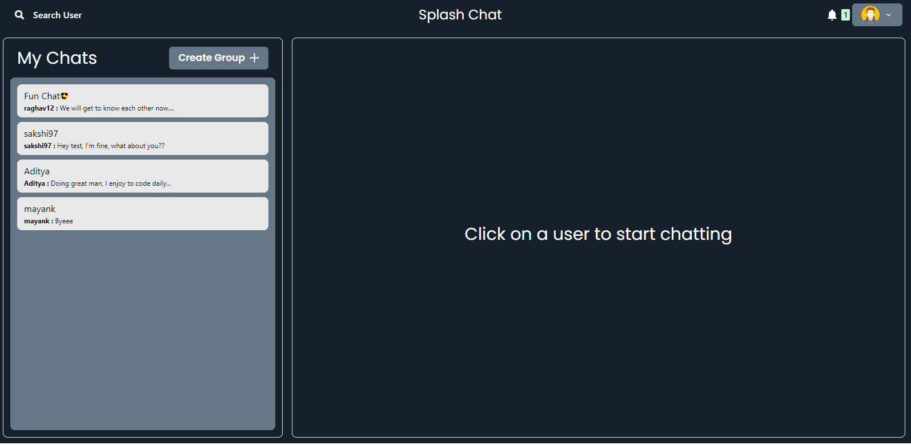
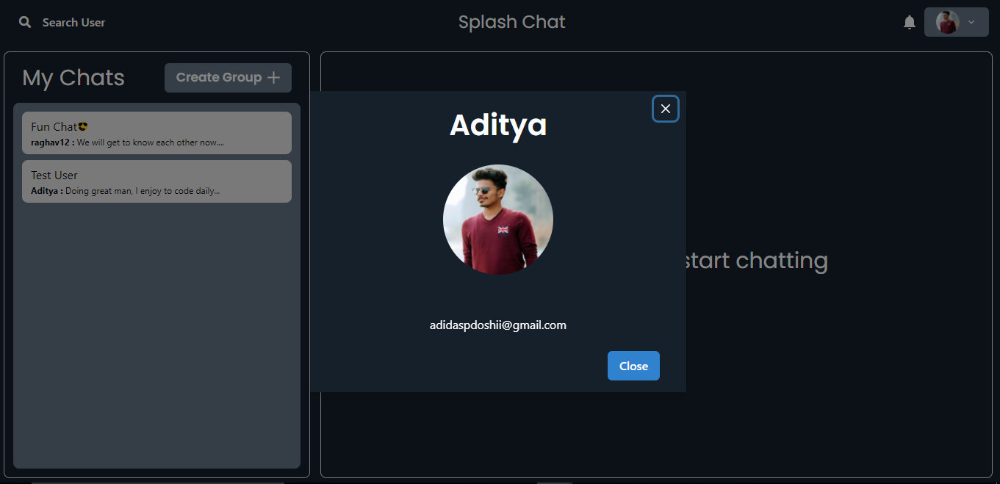

# Real Time Chat Application -

### Build with Socket.io Javascript library that enables realtime, bidirectional communication between web clients & servers.

- Socket.io client side (frontend) -> runs in browser
- Socket.io server-side (backend) -> Node.js

### Backend -

- Nodejs + Expressjs + MongoDB + Mongoose

### Frontend -

- ReactJs as Javascript library
- Chakra UI for building app user interface -> (accessible component library for React applications)

## Core Features of the app -

- Complete user authentication with JWT auth token (user signup & login).
- Search functionality to find registered users on the app.

- Chat screen where real time messages of respective users are fetched.

- Send direct message / communication between two users is possible with help of socket.io

- Group chat feature wherein members can be added by an admin & users can message at the same time.

- Add member to group & remove member from group is restricted to the admin user control.
- User can leave a group.
- Typing animation when both the users are online & messaging each other. (lottie animation usage)

- Notification bar, if the user is online & a group chat or single user message is received & user is on a different chat, live notification count is displayed with details.

- Cloudinary storage for user profile picture

